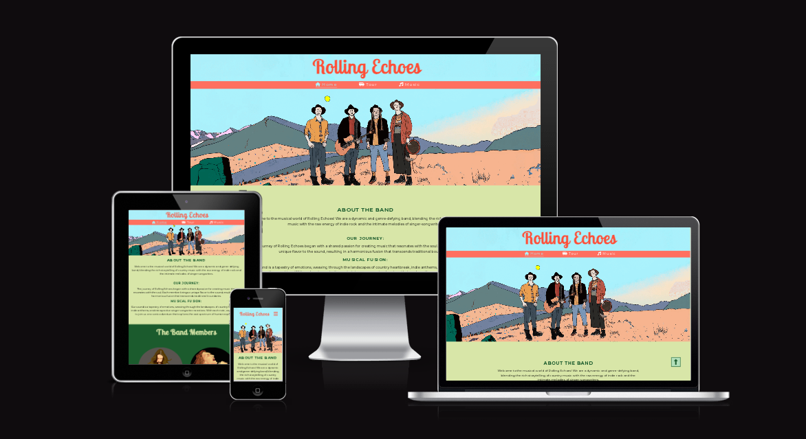

# Rolling Echoes Band Page

Rolling Echoes is a website that brings the virtual stage to life for our fictional band. This repository serves as the backstage pass to the web code that powers our official band page.

The fictional band page for Rolling Echoes is designed for fans, followers, and anyone interested in exploring the world of Rolling Echoes. It serves as an online platform where people can dive into the latest updates, music releases, tour information, and immerse themselves in the unique musical blend of country, indie rock, and singer-songwriter vibes that define the band's sound. The site is created to provide an engaging and interactive experience for individuals who appreciate the music and want to connect with the band's journey.

Visit the deployed site: [Rolling Echoes](<https://elindalenback.github.io/Project1-band/music.html>)

