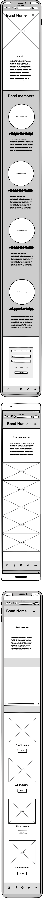

# Rolling Echoes Band Page

Rolling Echoes is a website that brings the virtual stage to life for our fictional band. This repository serves as the backstage pass to the web code that powers our official band page.

The fictional band page for Rolling Echoes is designed for fans, followers, and anyone interested in exploring the world of Rolling Echoes. It serves as an online platform where people can dive into the latest updates, music releases, tour information, and immerse themselves in the unique musical blend of country, indie rock, and singer-songwriter vibes that define the band's sound. The site is created to provide an engaging and interactive experience for individuals who appreciate the music and want to connect with the band's journey.

Visit the deployed site: [Rolling Echoes](https://elindalenback.github.io/Project1-band/music.html)

## Site Owner Goals for Rolling Echoes Band Page

**1. To Engage Fans:**
Provide fans with immersive information about Rolling Echoes, focusing on the band's musical journey and the unique fusion of country, indie rock, and singer-songwriter vibes.

**2. Showcase Music and Updates:**
Deliver clear and concise updates on the latest music releases, tour dates, and information about the band its the members.

**3.User-Friendly Experience**
Design a website that is easy to navigate, fully responsive, and reflects the band's style. Use appropriate colors and imagery to create an online space that resonates with the band's identity and invokes a sense of connection with the audience.

**4. Connect Fans with Local Scenes:**
Enable fans to discover local scenes by providing information about venues, events, and opportunities to experience Rolling Echoes live. Facilitate connections with the band's music beyond the digital space.

**5. Community Engagement:**
Offer a sign-up option for the Rolling Echoes Newsletter to keep fans in the loop about exclusive content and updates.

## User Experience (UX)

### User Stories

#### First-time User

- As a first-time fan, I want to understand the musical journey of Rolling Echoes and discover the unique blend of country, indie rock, and singer-songwriter vibes that define the band's sound.
- As a first-time fan, I want to navigate the band page intuitively, creating a positive and engaging experience as I explore the latest updates and music releases.
- As a first-time fan, I want to explore Rolling Echoes' content without the need to sign up or register, allowing me to get a feel for the band's style.

#### Returning User

- As a returning fan, I want to easily navigate to the latest music releases.
- As a returning fan, I want to discover upcoming tour dates and venues to plan my attendance at Rolling Echoes' live performances.

#### Dedicated User

- As a dedicated fan, I want to sign up for the Rolling Echoes newsletter to receive exclusive updates about new music, tour announcements, and behind-the-scenes content.
- As a dedicated fan, I want to contribute by sharing my experiences, suggesting ideas, and connecting with fellow fans in the Rolling Echoes community.

## Design

### Colour Scheme

I have chosen my colors to evoke a sense of the band and optimize the user experience and accessibility. The colors I've used are listed below, along with their respective placements.

- #000000 & #ffffff are used for the sites text.
- #31572c, #fe654f & # dce2aa are the main colors I have chosen, using them rotationally for backgrounds and headings.
- The green color is also used for buttons - going from shades dark to light.
- #fe654f is used in the band name logo to make a bold first impression. It is also used in the nav and icons for social media icons in footer.

Additionally, I've extracted the blue color (#baf0f9) from the header picture to maintain consistency across the music and tour pages, as well as in the footer, ensuring a cohesive overall styling.

**#baf0f9 color for header and footer**

### Typography

*Google Fonts fas used to import the fonts.*

For the Band Name Logo in the header, I opted for the 'Lobster Two' font with a fallback of sans-serif for versatility. This choice is consistently extended to the band members section and the 'Thank you' message in the feedback.html page. This intentional selection aims to emphasize a direct and cohesive visual connection with the essence of the band throughout the website.

For the body text, I've implemented the sans-serif font 'Montserrat.' I chose a sans-serif font as it enhances readability on screens. The fallback font in this case is, of course, sans-serif, ensuring a consistent and visually pleasing presentation across various devices.

## Wireframes

Wireframes were produced using Balsamiq.

 

 
Desktop Wireframe

 

 

    
Mobile Wireframe

 

## Features

The website has 4 pages. One home page, one Tour page, one Music page, and one Thank you page. All pages are responsive and have:

A favicon in the browser tab.

The home, music, and tour page also have:

The name of the band at the top of every page and a navigation bar to easily navigate on the site. On mobile devices the navigation bar is displayed as a drop down toggle. The band name also works as a link to go back to the Home page. 
  

A footer with icons and links to social media pages. All links opens in new tabs. 

## The Home Page
The home page for Rolling Echoes displays a big picture of the band. And the first section contains an introduction to the band. 

### The Band Members
The second section contains pictures of the band members with short accompanying text.

When hoovering over the pictures on a laptop they scale up slightly. This feature is added to keep the user engaged on the site.

### Sign Up Form
The last section of the Home page contains a sign up form where the users can sign up to a newsletter to resieve the latest information from the band.

## Feedback page

When clicking the submit button on the form the site redirects the user to a feedback page. This is to keep the user infromed that their inforation has been correctly sent and improve their user experience.

## The Tour Page

This page contains a short text and about the live experience with the band. 

### The Tour Dates

This section contains images of the citys where the band will performe. Each picture contains the country, city, date, venue, and time. When a picture/location is hoverd on a laptop it scales up to improve user experience and to indicate that it is a clickable link. The link redirects the user to a ticket sight.

Not hovered

Hovered

## The Music Page

The Music Page first section contains a short text about the latest releases. Then it displays a video segment where the bands latest music video is supposed to be.

### The Albums

After this there is an Albums section where the bands latest albums are displayd. The images of the albums are accompanied with a "Listen-Button" whith a link that redirects the user to Spotify.

## Other Feauters

- The buttons change color when hoverd.
  
- The pages in the navbar have both hover and when you enter one of the pages this icon/name is then underlined and slightly changed in color. 
  
- On larger screens/laptops there is a "Scroll Back to Top" feature added in the form of an arrow. When clicked the user will be scrolled back to the top of the page. It also has a hover effect to indicate that the user is holding the mouse over something clickable.

 When not hoverd.

 When hoverd.
  
**The aforementioned elements are implemented to enhance user interaction and improve overall user experience.**
